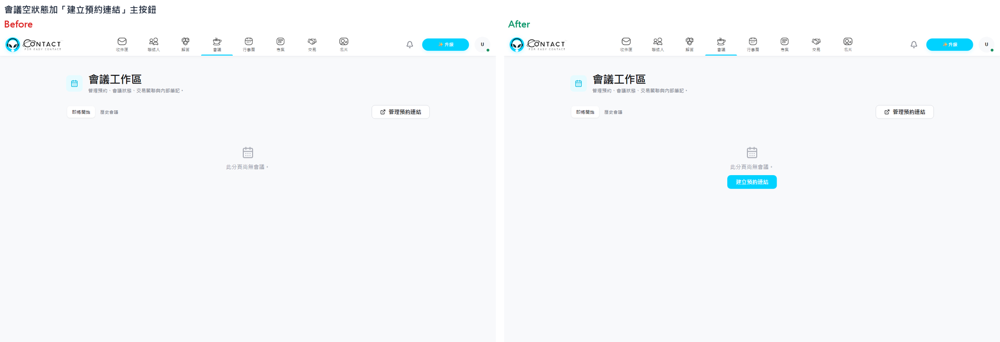

# Day 2｜從 IssueFlow 開發驗收到上線前稽核

> 本日 6 小時，對應 `course-outline/day2/outline.md`。學員會把 Day 1 的 IssueFlow 驗收標準轉成測試，再用安全基準與實際證據收尾。完整交付規格見 [`issueflow-project-assignment.md`](../materials/issueflow-project-assignment.md)。

## u-d2-u1：把「幫我測試」轉成 TDD、E2E 與 SOP

**對應章節**：Ch03｜開發驗收期（P22–P33）  
**建議時長**：3 小時（講授／示範 1 小時、實作 1 小時 45 分鐘、回顧／測驗 15 分鐘）  
**對應任務**：`d2-u1-t1`、`d2-u1-t2`、`d2-u1-t3`、`d2-u1-t4`  
**對應素材**：`materials/issueflow-project-assignment.md`、`materials/lab/`、`materials/tdd-e2e-sop-workbook.md`、`materials/sop-template.md`

**圖片需求 (illustrations)**:

- `d2-u1-tdd-red-green-refactor.png` — `diagram`／用紅燈、綠燈、重構三個不同形狀節點表示 TDD 迴圈。
- `d2-u1-e2e-to-sop.png` — `diagram`／使用者流程 → Playwright 腳本 → 截圖 → SOP，標出機器與人各自使用的產物。
- `07-e2e-screenshots.png`、`08-generated-sop.png` — `screenshot`／使用現有 `live-slides/assets/07-e2e-screenshots.png` 或 `08-generated-sop.png` 作為示範快照。
- `13-e2e-ui-compare.png` — `screenshot`／使用現有 `live-slides/assets/13-e2e-ui-compare.png`：E2E 截圖延伸成 UI 修正前後（Before／After）並排比對圖，取自實際專案 UX 稽核。

### 講師講稿

開發驗收不是最後一天才問 AI「幫我測試」。如果測試是程式寫完之後才補，AI 很容易根據既有實作倒推測試，最後產生的是「證明自己寫得對」的鏡子，而不是獨立的規格。

TDD 的核心循環是 Red、Green、Refactor：先寫一個描述行為的測試，確認它因為功能不存在而失敗；再寫最小實作讓它通過；最後整理程式而不改變行為。Martin Fowler 對 TDD 的摘要也是先列測試案例，再反覆執行這三步。[Test Driven Development](https://www.martinfowler.com/bliki/TestDrivenDevelopment.html)

本課的紅燈要有意義。紅燈不是「任何錯誤都可以」，而是要確認失敗原因與我們要驗證的規則一致。例如測試應該因為 `canCompleteTask` 尚未實作而失敗，而不是因為 import 路徑錯或 fixture 不存在。

接著把一條高價值使用者流程交給 Playwright。Playwright Test 的基本模型是執行使用者動作，再用 `expect` 斷言畫面狀態；官方文件也建議使用者可見行為與隔離測試，而不是依賴內部函式或 CSS 實作細節。[Playwright Writing Tests](https://playwright.dev/docs/writing-tests) 、[Playwright Best Practices](https://playwright.dev/docs/best-practices)

我們的流程是：開啟任務頁、確認後續任務被阻塞、完成前置任務、確認阻塞解除、確認進度與下一步建議更新。這個腳本要能重跑，不能只在互動終端機裡手動點一次。官方 CLI 可用 `npx playwright test` 執行全套測試，也可用 `--headed` 或 `--ui` 協助除錯。[Running and debugging tests](https://playwright.dev/docs/running-tests)

最後是 SOP。E2E 給機器回歸，截圖與說明給人操作。SOP 不是把測試輸出原封不動貼上，而是補上每一步的目的、預期結果、常見錯誤與回復方式。流程變更時，先重新跑測試，再更新截圖與 SOP，避免文件和實際畫面分叉。

E2E 截圖還有第三種用途：UI 差異比對。做 UX 稽核或改版時，把修正前的截圖與修正後重跑 E2E 產出的截圖並排，就是一份「畫面實際長怎樣」的證據，比看程式碼 diff 直觀得多。下圖是實際專案的例子：稽核指出會議頁空狀態只有一句灰字、沒有下一步；修正後重跑同一支走查腳本，右圖多了「建立預約連結」主按鈕。



做法只有三步，都可重跑：① 稽核時用 E2E 走查腳本截下原圖並保留；② 修正後以不同輸出目錄重跑同一支腳本；③ 用一支小腳本把兩張圖等高縮放、左右並排、頂部標題列寫 Before／After 與這張圖要證明的修正點。並排圖本身就是驗收證據，可直接貼進 PR 或稽核報告。

工作上若使用 Linear，也可以把 Issue 與 branch、commit、pull request 串起來，讓「需求 → 程式變更 → 驗收證據」更容易追溯；Linear 官方 GitHub 文件把這類連結與部分狀態自動化列為整合能力。[GitHub integration](https://linear.app/docs/github-integration) 但本課不要求設定整合，學員用 `artifacts/issueflow/` 保留的測試、截圖與 SOP 就能完成同樣的追溯練習。

### TDD 示範提示詞

```text
請針對 IssueFlow 的任務相依規則採用 TDD，先不要寫正式實作。

規則：
1. 任務依賴尚未完成的前置任務時，狀態為 BLOCKED。
2. BLOCKED 任務不可完成，也不可被推薦為下一步。
3. 前置任務完成後，後續任務可完成，並可成為下一步候選。
4. 同優先級時，createdAt 較早者優先；若時間相同，id 較小者優先。

請先產出測試清單，涵蓋正常路徑、邊界值與錯誤分支。
接著只寫測試並執行一次，將失敗原因貼出來。
在我確認紅燈前，不要寫實作程式碼。
```

### Playwright 示範提示詞

```text
請把以下 IssueFlow 使用者流程寫成可重跑的 Playwright Test 腳本，放在 e2e/task-dependency.spec.js：
1. 開啟單一專案的 Issue 清單。
2. 找到依賴未完成前置 Issue 的後續 Issue。
3. 驗證後續任務顯示 BLOCKED，且完成按鈕不可用。
4. 標記前置任務完成。
5. 驗證後續任務解除 BLOCKED、進度增加、下一步建議更新。

要求：
- 優先使用 role、label、visible text 或 data-testid，不要依賴脆弱 CSS 階層。
- 每個關鍵步驟留下 screenshot。
- 失敗時輸出足以定位步驟的訊息。
- 不要使用一次性互動指令，必須輸出可提交到 repository 的腳本檔。
```

### 實作任務

#### `d2-u1-t1` 先寫 IssueFlow 紅燈測試

1. 使用 `materials/lab/task-rules.test.js`。
2. 先執行 `node --test task-rules.test.js`。
3. 確認失敗原因是功能尚未完成，而不是執行環境錯誤。
4. 將紅燈輸出保存到 `artifacts/tdd-red.txt`。

#### `d2-u1-t2` 寫最小 IssueFlow 實作到綠燈

1. 只實作 `canCompleteTask` 與 `getNextTask` 所需的最小規則。
2. 不順手加入登入、資料庫、框架或未列入計畫的功能。
3. 執行 `node --test task-rules.test.js`，保存綠燈輸出。
4. 進行一次小型重構，再次執行測試。

#### `d2-u1-t3` 建立可重跑 IssueFlow E2E

1. 執行 `python -m http.server 4173`，在 `materials/lab` 提供靜態頁面。
2. 執行 `npx playwright test task-tracker.spec.js`。
3. 檢查 `artifacts/e2e/` 是否有每個關鍵步驟的截圖。
4. 失敗時先讀 trace／報告，不直接放寬斷言。

#### `d2-u1-t4` 產出 IssueFlow SOP

依截圖整理 `artifacts/issueflow/ch03-validation/sop.md`，每一步要包含：操作、畫面證據、預期結果、失敗時的下一步。

### 產物驗收

- [ ] 紅燈輸出可說明「為什麼失敗」。
- [ ] 綠燈後至少重構一次且測試仍通過。
- [ ] E2E 腳本可重跑，且主要斷言針對使用者可見行為。
- [ ] 每個關鍵流程有截圖與步驟編號。
- [ ] SOP 與最新一次 E2E 執行畫面一致。
- [ ] 已把測試、輸出、截圖與 SOP 放入 `artifacts/issueflow/ch03-validation/`，可交給 Ch04 做稽核。

### 課中測驗 q3

**sourceUnit**：`d2-u1`  
**題目**：為什麼要要求 AI 先寫測試、確認紅燈，再寫實作？

- A. 測試通常比程式碼短
- B. 先寫測試能讓行為規格先被檢查，避免測試只反射既有實作
- C. 這樣一定不會有 bug
- D. Playwright 規定所有程式都要 TDD

答案與解析放在講師教材 [`materials/quiz-answer-key.md`](../materials/quiz-answer-key.md)。

## u-d2-u2：把「幫我找漏洞」轉成基準式稽核

**對應章節**：Ch04｜上線前（P34–P46）  
**建議時長**：3 小時（講授／示範 1 小時、實作 1 小時 15 分鐘、回顧／測驗 45 分鐘）  
**對應任務**：`d2-u2-t1`、`d2-u2-t2`、`d2-u2-t3`、`d2-u2-t4`  
**對應素材**：`materials/issueflow-project-assignment.md`、`materials/security-audit-template.md`、`materials/security-baseline-2025.md`、`materials/source-registry.md`

**圖片需求 (illustrations)**:

- `d2-u2-baseline-audit.png` — `diagram`／程式碼稽核與相依套件稽核兩條路徑匯入同一份報告。
- `d2-u2-finding-remediation.png` — `diagram`／發現 → 重現 → 修補 → 回歸驗證 → 保留證據。
- `09-security-audit.png`、`10-dependency-audit.png`、`11-fix-before-after.png` — `screenshot`／使用現有 `live-slides/assets/09-security-audit.png`、`10-dependency-audit.png` 與 `11-fix-before-after.png` 的講師快照，註明為專案快照而非通用數據。

### 講師講稿

「幫我看看有沒有漏洞」聽起來積極，卻沒有告訴 AI 要覆蓋哪些項目。沒有基準時，報告很容易只列出三五個大家都聽過的風險；你無法知道它是查完了，還是只挑了容易說的部分。

本課使用兩層基準。第一層是自有程式碼對照 OWASP Top 10:2025 與 CWE Top 25；第二層是第三方相依套件的已知漏洞與修補版本。OWASP Top 10:2025 的十個類別包含 Broken Access Control、Security Misconfiguration、Software Supply Chain Failures、Cryptographic Failures、Injection、Insecure Design、Authentication Failures、Software or Data Integrity Failures、Security Logging and Alerting Failures、Mishandling of Exceptional Conditions。[OWASP Top 10:2025](https://owasp.org/Top10/)

CWE Top 25 是 MITRE 維護的常見且具影響性的軟體弱點清單；官方頁面說明 2025 清單的資料集涵蓋 39,080 筆 CVE 紀錄。課堂不把這個數字當成學員專案的漏洞數量，而是把它當成基準資料的來源背景；實際報告仍要回到我們的程式碼與測試證據。[CWE Top 25](https://cwe.mitre.org/top25/)

第三方套件則用 `npm audit` 取得專案自己的現況。npm 官方文件說明 `npm audit` 會將依賴描述送至 registry 取得已知漏洞報告，沒有漏洞時 exit code 為 0；有些修補不能自動完成，需要人工判斷。`npm audit fix` 也可能執行完整的 install，因此不能在沒有檢查 diff 的情況下盲目執行。[npm audit](https://docs.npmjs.com/cli/v11/commands/npm-audit/)

若報告使用 CVSS，必須標示版本。FIRST 的官方文件目前以 CVSS v4.0 為主要標準，Base、Threat、Environmental、Supplemental 是不同群組；課堂只要求學員記錄來源提供的分數與向量，不自行猜測嚴重度。[FIRST CVSS v4.0](https://www.first.org/cvss/v4.0/)

最後是界線。AI 輔助稽核可以做便宜的第一道網：幫我們對照清單、定位程式碼、提出修補建議。但它不等於滲透測試，也不會自動證明商業邏輯、競爭條件與真實攻擊路徑都安全。NIST SP 800-115 將安全測試視為包含規劃、執行、分析發現與制定緩解策略的完整活動；本課只做其中的初步稽核與可重現修補練習。[NIST SP 800-115](https://csrc.nist.gov/pubs/sp/800/115/final)

### 稽核提示詞

```text
請對照 OWASP Top 10:2025 與 CWE Top 25，逐項檢查 IssueFlow 專案程式碼與設定。

輸出 Markdown 表格，欄位必須是：
- 基準代號與名稱
- 是否命中：是／否／無法判定
- 程式檔案與行為位置
- 證據：測試輸出、回應或設定片段
- 風險等級與影響
- 修補建議
- 未命中或不適用的理由

要求：
1. 沒命中的項目也要列出，不能只列問題。
2. 不要把「沒有看到」寫成「不存在」；無法判定要標示需要什麼證據。
3. 不要宣稱已完成滲透測試。
4. 把使用者可看到的錯誤訊息與應寫入內部日誌的細節分開。
5. 另列出第三方相依套件、版本、已知 CVE、CVSS 分數／向量與建議升級版本。

先給稽核計畫與覆蓋範圍，等待確認後再產出報告。
```

### 實作任務

#### `d2-u2-t1` 建立 IssueFlow 基準表

使用 `materials/security-baseline-2025.md`，將每個基準項目轉成稽核欄位。不得只寫「安全／不安全」，必須有證據與不確定性。

#### `d2-u2-t2` 執行 IssueFlow 相依套件稽核

在 `materials/lab` 執行：

```powershell
npm audit --json > artifacts/npm-audit.json
npm audit --audit-level=moderate
```

若沒有 `package-lock.json`，先依 npm 官方文件建立或在報告中記錄缺少 lockfile 的限制。不要把直播投影片中的「5 個直接相依、106 個套件」當作本次執行結果；那是既有示範專案的歷史快照。

#### `d2-u2-t3` 重現 IssueFlow 一項問題

在本課提供的 lab 中加入一個刻意不當的錯誤處理：對外回傳 stack trace 或檔案系統路徑。使用測試或 `curl`／瀏覽器重現，保存修補前回應。

#### `d2-u2-t4` 修補、回歸與最終展示

1. 對外只回傳穩定的錯誤代碼與一般訊息。
2. 內部日誌保留 correlation id、例外類型與 stack trace，但不得把 secret 寫入日誌。
3. 新增回歸測試，驗證對外回應不包含工作區路徑或 stack trace。
4. 重新執行 TDD／E2E 與稽核，將前後證據放入報告。
5. 將報告與展示摘要存成 `artifacts/issueflow/ch04-security-audit.md`、`ch04-remediation.md` 與 `final-summary.md`。

### 產物驗收

- [ ] 稽核表列出命中、未命中與無法判定項目。
- [ ] OWASP、CWE、npm audit 與 CVSS 來源有版本與連結。
- [ ] 至少一項問題有修補前回應、修補後回應與回歸測試。
- [ ] 對外錯誤與內部日誌的資訊分流清楚。
- [ ] 報告沒有把 AI 稽核宣稱成滲透測試。
- [ ] 最終展示能在 5 分鐘內串起 Ch01 報告、Ch02 計畫、Ch03 測試與 Ch04 修補證據。

### 課中測驗 q4

**sourceUnit**：`d2-u2`  
**題目**：哪一個提問最能逼出資安稽核的覆蓋率？

- A. 幫我看看有沒有漏洞。
- B. 幫我找出所有問題。
- C. 對照 OWASP Top 10:2025 逐項檢查，未命中也要列出並說明原因。
- D. 幫我做一次滲透測試。

答案與解析放在講師教材 [`materials/quiz-answer-key.md`](../materials/quiz-answer-key.md)。
